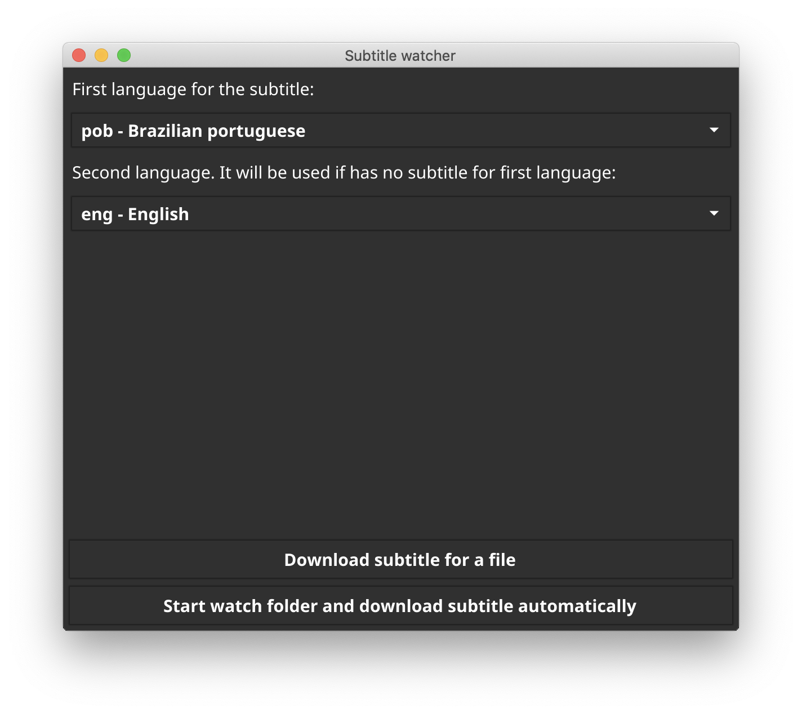
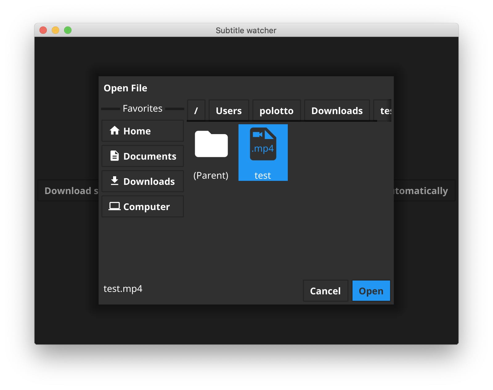
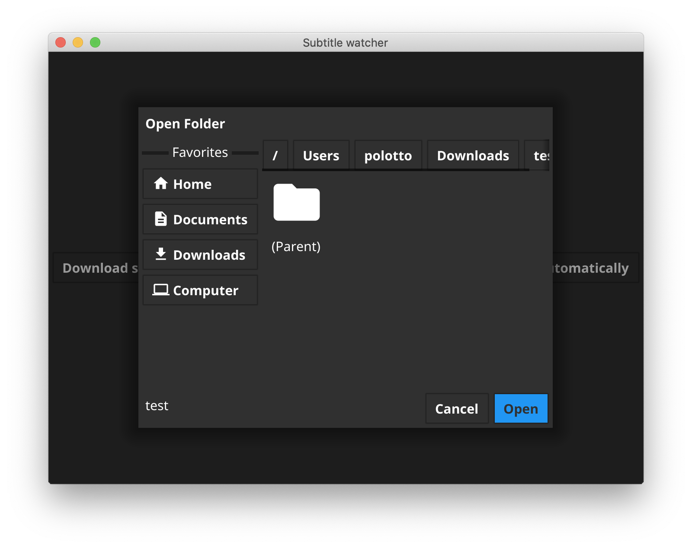

# subtitlewatcher

## English
A simple Go app to watch a folder for new video files and download the subtitle automatically.

### Motivation
After research solution to download subtitles, I didn't found any application that have the following features:

- open source: I can see what I'm installing on my computer;
- watch a specific folder and download subtitle automatically when find a new video file;
- option to download a subtitle of a chosen video file by user;

The **subtitlewatcher** fill all those requirements. 

### Installation
Open [releases page](https://github.com/polotto/subtitlewatcher/releases) and download the version for your system, unzip and execute.

- For MacOs user: the application isn't assigned by Apple, you will need authorize the execution in **System Preferences / Security & Privacy** menu. 

## Screenshots
- Main screen:

- Download subtitle screen:

- Watch folder screen:

## Português
Uma simples aplicação em Go para monitorar uma pasta por novos arquivos de vídeo e fazer _download_ da legenda automaticamente.

### Motivação
Depois de pesquisar, não encontrei nenhum _software_ que possua as seguintes características:

- _open source_: quero ver o que estou instalando no meu computador;
- monitorar uma pasta específica e fazer _download_ da legenda automaticamente quando encontrar um novo arquivo de vídeo;
- opção para fazer _download_ de legenda para um arquivo de vídeo escolhido pelo usuário;

O **subtitlewatcher** preenche todos esses requisitos. 

### Instalação
Abra [releases page](https://github.com/polotto/subtitlewatcher/releases) e faça _download_ da versão para o seu sistema, descompacte e execute.

- Para usuário MacOs: a aplicação não é assinada pela Apple, você vai precisar autorizá-la no em **Preferência do Sistema / Segurança & Privacidade**(**System Preferences / Security & Privacy**).

## Telas do aplicativo
- Tela principal:

- Tela para download de legenda:

- Tela para monitorar uma pasta:
